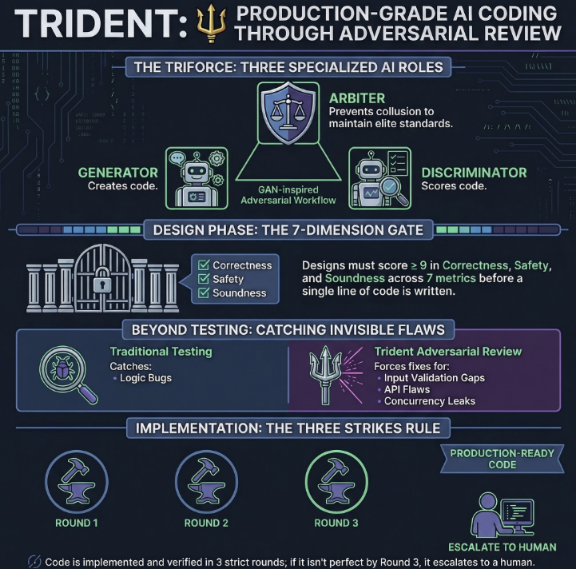
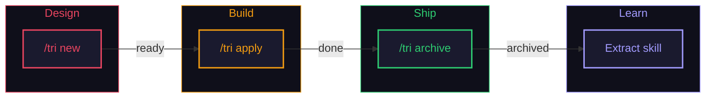
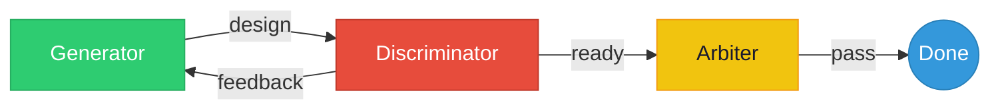

<h1 align="center">Trident</h1>
<p align="center"><i>One agent skill. Three adversarial minds.</i></p>

<!-- Replace 0xFiMo with your GitHub username -->
<p align="center">
  <a href="https://github.com/0xFiMo/trident/stargazers"></a>
  <a href="https://github.com/0xFiMo/trident/blob/main/LICENSE"></a>
  
  
</p>


> *"As iron sharpens iron, so one person sharpens another."* — Proverbs 27:17


### Why "Trident"?

A trident has three prongs — none works alone. Remove one and it's just a stick. Trident applies the same idea to AI agents: `Generator`, `Discriminator`, and `Arbiter` — three roles that hold each other accountable. No single agent can declare its own work "done."

---

### The Problem

You ask your AI agent to build something. It does. You ask it to review its own work. It says "looks good." You ship it. Then production breaks.

**This keeps happening because:**

| What you expect | What actually happens |
|-----------------|----------------------|
| "Handle all edge cases" | Agent handles the happy path, skips the rest |
| "Write production-quality code" | No input validation, no error boundaries |
| "Review your work" | Agent reviews its own code and finds nothing wrong |
| "Fix the bug" | Agent fixes one bug, introduces two more |

The root cause: **an AI agent reviewing its own work is like a student grading their own exam.** The incentive is to pass, not to find problems.

### The Fix

**Let a second AI agent grade the exam.** And a third one make sure neither is cheating.

Trident turns one agent's monologue into a three-way adversarial review. The `Generator` builds. The `Discriminator` attacks. The `Arbiter` keeps them honest. Your code ships only when all three agree it's ready.

Works with any model. Even non-tier-1 models produce senior-level output with Trident — because quality comes from the process, not just the model.


<p align="center">
  
</p>

---

## Installation

### For Humans

Copy and paste this to your AI agent (Claude Code, OpenCode, Cursor, etc.):

```
Install Trident design review skill by following these instructions:
https://raw.githubusercontent.com/0xFiMo/trident/main/docs/installation.md
```

Or just run the installer yourself:

```bash
git clone https://github.com/0xFiMo/trident.git /tmp/trident
cd /tmp/trident && ./install.sh
```

### For AI Agents

Fetch and follow:

```
curl -s https://raw.githubusercontent.com/0xFiMo/trident/main/docs/installation.md
```

### Supported Platforms

| Platform | Status |
|----------|--------|
| [Claude Code](https://docs.anthropic.com/en/docs/claude-code) | Supported |
| [OpenCode](https://opencode.ai/) | Supported |
| Any agent with SKILL.md support | Compatible |

| OS | Status |
|----|--------|
| macOS | Supported (`heartbeat.sh`) |
| Linux | Supported (`heartbeat.sh`) |
| Windows (WSL) | Supported (`heartbeat.sh`) |
| Windows (native) | Supported (`heartbeat.ps1`) |

---

## Commands

`/tri` — sounds like "try." Every great creation starts with a try.

| Command | What It Does |
|---------|-------------|
| `/tri new "description"` | **Try** a new design. `Generator` designs, `Discriminator` scores, `Arbiter` verifies. Iterates until all 7 dimensions >= 9. |
| `/tri apply` | **Try** to build it. Three Strikes — 3 rounds of `Generator` + `Discriminator` + `Arbiter` verification. |
| `/tri archive` | Done **try**ing. Archive it and extract what you learned. |
| `/tri status` | Check what you're **try**ing and what's done. |

The lifecycle is strictly sequential. The agent cannot skip ahead:



---

## Does It Actually Work?

Same model (`Kimi K2.5`). Same prompt. Same task. Only difference: one used Trident, one didn't.

**Without Trident** — agent delivers code with 6 hidden issues. Tests pass. Looks fine. Ships broken.

**With Trident** — `Discriminator` catches all 6 in adversarial review. Fixed before a single line ships.

```mermaid
---
config:
  themeVariables:
    xyChart:
      plotColorPalette: "#e74c3c, #2ecc71"
---
xychart-beta
    title "Hidden Production Issues (lower is better)"
    x-axis ["Encapsulation", "Input Valid.", "Immutable API", "Time Overflow", "Race Cond.", "API Design"]
    y-axis "Issue Severity" 0 --> 10
    bar [9, 9, 8, 8, 7, 6]
    bar [0, 0, 0, 0, 0, 0]
```


>  Without Trident &nbsp;&nbsp;  With Trident

**Tests catch logic bugs. Trident catches everything tests can't:**

| | Tests alone | + Trident |
|---|:---:|:---:|
| Input validation gaps | ❌ | ✅ |
| Encapsulation leaks | ❌ | ✅ |
| API design flaws | ❌ | ✅ |
| Concurrency semantics | ❌ | ✅ |

> [Full benchmark data with reproduction steps →](benchmarks/)

### See It In Action

Weather animation built with `MiniMax M2.7` — left is the original code, right is after Trident optimization:

https://github.com/user-attachments/assets/d23f7c70-97f5-476c-910e-252e0bcc722c

---

## How It Works

### The Triforce — Three Roles



| Role | Analogy | Memory | What It Actually Does |
|------|---------|--------|----------------------|
| `Generator` | GAN Generator | Persistent | Explores codebase. Produces designs with root cause analysis, state transition tables, change surface estimates. Implements code. Self-audits against its own spec. |
| `Discriminator` | GAN Discriminator | Session continuity | Scores every design across 7 dimensions. Cites specific methods, line numbers, data flow. Classifies issues as MUST FIX or NICE TO HAVE. Accumulates knowledge — never re-checks what it already verified. |
| `Arbiter` | Independent evaluator | None (always fresh) | Zero context, zero bias. Checks if `Generator` and `Discriminator` are colluding. Catches blind spots neither addressed. Can override READY if convergence looks artificial. |

**Why three, not two?** A `Generator` + `Discriminator` pair converges too easily. The `Discriminator` gets lenient after watching the `Generator` improve. The `Arbiter` prevents this — fresh every time, no sympathy.

### Seven Dimensions

Every design is scored across 7 dimensions. **All must reach >= 9/10 score:**

| Dimension | What It Measures |
|-----------|-----------------|
| Correctness | Logic correct, no crash on any input |
| Algorithmic Soundness | All scenarios, boundaries, interactions |
| Safety | Defensive input validation, fail-safe, backward compat |
| Measurability | Verification coverage with available resources |
| Minimality | Minimal change surface |
| Testability | Test coverage, edge cases |
| Conventions | Matches existing codebase patterns |

Missing input validation? **MUST FIX**, never NICE TO HAVE. If any input can crash your code, Safety cannot be >= 9/10.

### Design Phase (`/tri new`)

`Generator` and `Discriminator` iterate until all 7 dimensions pass. No round limit.


### Implementation Phase (`/tri apply`)

Three Strikes — three rounds, then escalate to human:

| Round | Roles | On `Discriminator` Pass | On `Discriminator` Fail |
|-------|-------|-----------|-----------|
| 1 | `Generator` implements + `Discriminator` reviews | `Arbiter` verifies → done or keep fixing | Round 2 |
| 2 | `Generator` fixes + `Discriminator` re-reviews (same session) | `Arbiter` verifies → done or keep fixing | Round 3 |
| 3 | `Generator` + `Arbiter` collaborate | Done | Human-in-the-loop escalation |

**Key rule:** `Discriminator` FAIL consumes a round. `Arbiter` FAIL does NOT — `Generator` fixes and re-submits within the same round.

Round 3 exhausted? `Generator`, `Discriminator`, and `Arbiter` each submit their perspective. The human decides.

### Archive Phase (`/tri archive`)

Done? Archive it. Trident moves the working files to `.trident/archive/` and asks one question:

> *"This review uncovered insights about [domain]. Want me to create a skill?"*

If yes — the agent distills root causes, design decisions, and pitfalls into a reusable skill. Your agent gets smarter with every review.

---

## Design Philosophy

### Three Pillars

| Pillar | Origin | What It Prevents |
|--------|--------|-----------------|
| **GAN** | Generative Adversarial Networks | Complacency — `Generator` can't ship until `Discriminator` is satisfied, `Discriminator` can't rubber-stamp because `Arbiter` is watching |
| **Three Strikes** | Baseball + Chinese proverb | Infinite loops — three rounds max, then escalate to human |
| **Triforce** | Three-role balance | Collusion — `Generator` and `Discriminator` can't agree to lower standards because `Arbiter` arrives fresh with no history |

### Space for Memory

AI agents forget. Context windows fill up. Sessions expire. Trident solves this by **trading disk space for memory** — each role writes its knowledge to markdown files that persist across sessions, rounds, and even platform restarts.

These files serve three purposes at once:
1. **Agent memory** — `Generator`, `Discriminator`, and `Arbiter` recover context from their own files instead of relying on session state
2. **Role isolation** — each role can only read the other's file, never write to it. No contamination.
3. **Human auditability** — open any `.md` file to see exactly what each role thought, scored, and decided. No black box.

```
.trident/{task-slug}/
├── generator.md        ← Generator's memory: design + version history + feedback
├── discriminator.md    ← Discriminator's memory: verified facts, patterns, blind spots
├── tasks.md            ← Implementation checklist (created by /tri apply)
├── apply-log.md        ← Round log with 7-dimension scores
└── .done               ← Signal file for background agent completion
```

| File | Who Writes | Who Reads | Survives Session Loss? |
|------|-----------|-----------|:----------------------:|
| `generator.md` | `Generator` | All roles | Yes — full design history |
| `discriminator.md` | `Discriminator` | All roles | Yes — `Discriminator` rebuilds context from this |
| `tasks.md` | `Generator` | `Generator` | Yes — resume from last checkbox |
| `apply-log.md` | `Generator` | All roles | Yes — round scores preserved |
| `.done` | `Discriminator` or `Arbiter` | heartbeat.sh | Transient — deleted before each invocation |

---

## Contributing

PRs welcome. Test with both Claude Code and OpenCode before submitting.

## Support ⭐☕

If Trident made your agent smarter, three things that help the most:

1. **Star this repo** — it helps others discover Trident
2. **Share it** — tell your team, post it, spread the word
3. **Follow [@FiMoTW on X](https://x.com/FiMoTW)** — updates, tips, and new features

And if you're feeling generous, buy me a coffee:

| Network | Address |
|---------|---------|
|  | `0xB95f5EC545F1650Ce43200F016A0C92A56C36513` |
|  | `7KZ7KBVCKAgX7TCAMRQyFctaVbKtTaAPVjoEfQKqUPFt` |

---

## Star History

<!-- Replace 0xFiMo with your GitHub username after creating the repo -->
[](https://star-history.com/#0xFiMo/trident&Date)

---
## References

- **GAN:** Goodfellow, I.J. et al. (2014). [Generative Adversarial Networks](https://arxiv.org/abs/1406.2661). arXiv:1406.2661 — the adversarial tension between `Generator` and `Discriminator` that inspired Trident's core mechanic.
- **Three Strikes:** [Three-strikes law](https://en.wikipedia.org/wiki/Three-strikes_law) — borrowed from baseball ("three strikes and you're out"), codified in law as automatic escalation after three offenses. Rooted in the Chinese proverb 事不過三 ("things shall not exceed three"), popularized by Wu Cheng'en's *[Journey to the West](https://en.wikipedia.org/wiki/Journey_to_the_West)* (c. 1592) — where Sun Wukong's battles famously follow a three-attempt pattern. The proverb teaches perseverance through three tries, but also the wisdom to escalate when three attempts aren't enough. Trident applies this: three rounds of review, then the human decides.
- **Triforce:** [Triforce](https://en.wikipedia.org/wiki/Triforce) — three golden triangles representing Power, Wisdom, and Courage that must be in balance. In Trident: `Generator` (creates), `Discriminator` (evaluates), `Arbiter` (balances).
- **Kimi K2.5:** [Kimi K2.5](https://www.kimi.com/blog/kimi-k2-5) by [Moonshot AI](https://www.moonshot.ai/) — the model used in our benchmark experiments.
- **MiniMax M2.7:** [MiniMax M2.7](https://www.minimax.io/) by MiniMax — the model used in the weather animation demo.
---
## License

[MIT LICENSE](LICENSE)
